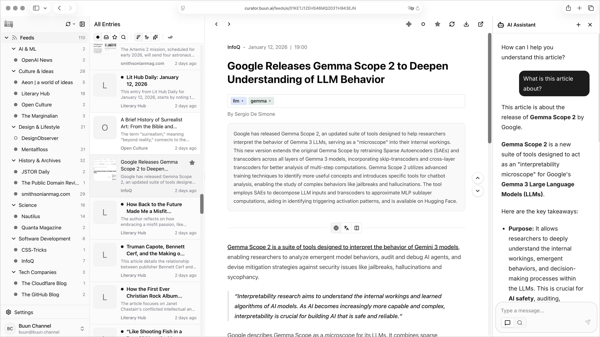

# Buun Curator (WIP)

**This project is under heavy development and is not production-ready.**

AI-powered information curator and research assistant, currently just a feed reader.



## Features

### Feed Reader

- **RSS/Atom Support** - Subscribe to any RSS/Atom feed with hierarchical category organization
- **Full-text Search** - Multilingual search by [Meilisearch](https://www.meilisearch.com/)
- **Sorting by Relevance** - pgvector-based similarity ranking using entry embeddings
- **Real-time Updates** - Instant feed updates via Server-Sent Events (SSE)

### Content Processing

- **Content Fetching** - Automatic full-content extraction using [Crawl4AI](https://github.com/unclecode/crawl4ai)
- **Content Filtering** - LLM-based noise removal (ads, navigation, boilerplate)
- **Summarization** - AI-generated summaries for quick scanning
- **Translation** - On-demand translation via DeepL or Microsoft Translator

### AI Assistant

- **Chat Interface** - Contextual AI assistant with real-time streaming responses by [CopilotKit](https://www.copilotkit.ai/) and [AG-UI](https://docs.ag-ui.com/introduction)
- **Entry Context** - AI understands the currently viewed entry for relevant responses
- **Research Mode**
    - **Structured Analysis** - LLM extracts domain classification, entities, relationships, and key points

### Authentication

- **Single Sign-On (SSO)** - OAuth2 authentication via [Keycloak](https://www.keycloak.org/) via [Better Auth](https://www.better-auth.com/)

> **Note:** Multi-user support is not implemented. Authentication is for access control only;
> all users share the same data.

### Quality & Observability

- **LLM Evaluation** - Integrated [RAGAS](https://docs.ragas.io/) for response quality scoring
- **LLM Tracing** - Store LLM calls, responses, and evaluation scores with [Langfuse](https://langfuse.com/)

### Background Processing

- **Durable Workflows** - Reliable task execution with [Temporal](https://temporal.io/)
- **Peiriodic Ingestion and cleanup** - Automated feed fetching and old entry removal

## Documentation

- Getting Started
    - [Getting Started](./docs/getting-started.md) - Local development setup (manual)
    - [Helm Chart](./charts/buun-curator/README.md) - Kubernetes deployment with Helm
- Development
    - [Development Guide](./docs/development.md) - Kubernetes-based development with Tilt
- Reference
    - [Terminology](./docs/terminology.md) - Common terms used in documentation and codebase
    - [CLI Reference](./docs/cli.md) - Command-line tools for Agent and Worker services
- Technical Details
    - [Next.js Application](./docs/app.md) - Database (Drizzle), API, and testing
    - [Query and Cache Design](./docs/query-and-cache.md) - React Query cache keys and UI action flows
    - [Temporal Workflows](./docs/workflow.md) - Workflow hierarchy, SSE notifications, activity patterns
    - [Content Fetching](./docs/fetch-content.md) - Content extraction rules with Crawl4AI
    - [CopilotChat Architecture](./docs/copilot-chat.md) - AI chat communication flow
    - [Context Extraction](./docs/context.md) - LLM-based context extraction (experimental)
    - [LLM Evaluation](./docs/llm-evaluation.md) - RAGAS evaluation with Langfuse
    - [Logs and Tracing](./docs/logs-and-tracing.md) - Structured logging and OpenTelemetry tracing

## Architecture

```text
┌─────────────────────────────────────────────────────────────────────────────┐
│                              Browser (React)                                │
└─────────────────────────────────────────────────────────────────────────────┘
        │                              │                             ▲
        │ REST API                     │ AG-UI (SSE)                 │ SSE
        ▼                              ▼                             │
┌─────────────────────────────────────────────────────────────────────────────┐
│                              Next.js App                                    │
│                       (API Routes, SSE Endpoint)                            │
└─────────────────────────────────────────────────────────────────────────────┘
        │              │              │              │               ▲
        │              │              │              │ Start         │ Notify
        ▼              ▼              ▼              ▼ Workflow      │
┌────────────┐ ┌────────────┐ ┌────────────┐ ┌────────────┐ ┌────────┴───────┐
│ PostgreSQL │ │Meilisearch │ │  AI Agent  │ │  Temporal  │ │ Python Worker  │
│(+ pgvector)│ │(Full-text) │ │  (FastAPI) │ │   Server   │ │ (Temporal SDK) │
└────────────┘ └────────────┘ └─────┬──────┘ └──────┬─────┘ └────────┬───────┘
                                    │               │ Task Queue     │
                                    │               └────────────────┘
                              ┌─────┴─────┐
                              │           │
                              ▼           ▼
                       ┌────────────┐ ┌────────────┐
                       │ OpenAI API │ │  Langfuse  │◀── RAGAS Scores
                       └────────────┘ │  (Tracing) │    (from Worker)
                                      └────────────┘
```

### Components

| Component | Technology | Description |
|-----------|------------|-------------|
| Frontend | Next.js (React) | Multi-panel feed reader UI with CopilotKit chat |
| API | Next.js API Routes | REST API for entries, feeds, subscriptions |
| AI Agent | FastAPI + AG-UI | Real-time streaming responses via Server-Sent Events |
| Worker | Python + Temporal | Durable workflow execution for background tasks |
| Database | PostgreSQL + pgvector | Entry storage, embeddings for recommendations |
| Search | Meilisearch | Full-text search with CJK language support |
| Observability | Langfuse | LLM tracing and RAGAS evaluation scores |

- [Next.js](https://nextjs.org/)
- [CopilotKit](https://www.copilotkit.ai/)
- [AG-UI](https://docs.ag-ui.com/)
- [FastAPI](https://fastapi.tiangolo.com/)
- [Temporal](https://temporal.io/)
- [PostgreSQL](https://www.postgresql.org/)
- [pgvector](https://github.com/pgvector/pgvector)
- [Meilisearch](https://www.meilisearch.com/)
- [Langfuse](https://langfuse.com/)
- [RAGAS](https://docs.ragas.io/)

### Gallery


AI assistant in research mode.
